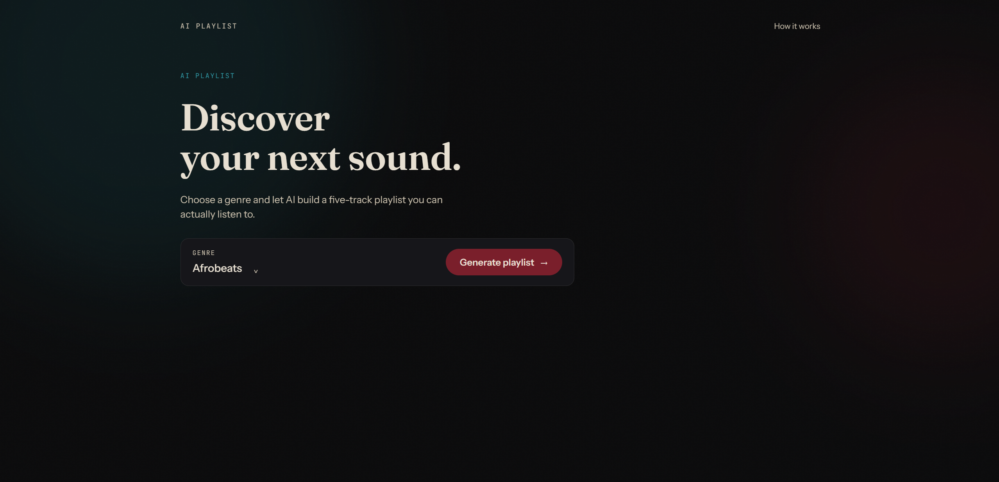

# Gridiron playlist

Pick a music genre from a dropdown, click a button, and get a five-track playlist
generated by a text-generation model — with 30-second previews, artwork, and store
links pulled from Apple's iTunes catalog.



## Project structure

```
gridiron-playlist/
├── backend/            FastAPI service: generates and enriches playlists
│   ├── core/           Settings and the genre/fallback-playlist constants
│   ├── api/            The single HTTP route
│   ├── models/         Pydantic request/response schemas
│   ├── services/       Prompting, parsing/orchestration, iTunes enrichment, providers
│   └── tests/          pytest suite, no network access
├── frontend/            Vue 3 + Vite single-page app
│   └── src/
│       ├── components/  Presentational components (bits/ is vendored, do not edit)
│       ├── composables/ Playlist state and audio-preview playback
│       ├── services/    The only place `fetch` is called
│       └── styles/      Design tokens and base styles
├── start.sh             Runs both halves locally
└── README.md
```

## Prerequisites

- Python 3.11+
- Node.js 18+ and npm
- An OpenAI API key (or run offline with the stub provider — see below)

## Getting a provider API key

1. Create an account at [platform.openai.com](https://platform.openai.com).
2. Generate an API key under API keys in your account settings.
3. Check OpenAI's current model list and pick a model that supports
   `response_format: {"type": "json_object"}` (e.g. a `gpt-4o` family model). Model
   identifiers change over time, so this app never hardcodes one — you set it yourself.

## Environment setup

```bash
cd backend
cp .env.example .env
```

Fill in `.env`:

| Variable | Notes |
|---|---|
| `PROVIDER_API_KEY` | Your OpenAI key. Not needed if `USE_STUB_PROVIDER=true`. |
| `PROVIDER_BASE_URL` | Leave as the default unless you're pointing at a compatible endpoint. |
| `MODEL_NAME` | Required — no default is provided. Set it to a current OpenAI model. |
| `ENABLE_ENRICHMENT` | `true` to fetch previews/artwork/store links from iTunes. |
| `USE_STUB_PROVIDER` | `true` to skip OpenAI entirely and run offline, for demos or tests. |
| `ALLOWED_ORIGINS` | Comma-separated origins allowed to call the API. |
| `REQUEST_TIMEOUT` | Seconds to wait on the provider before giving up. |

## Running locally

**Shortcut** — from the repo root:

```bash
./start.sh
```

This creates the backend virtual environment and installs dependencies if needed,
starts the backend on `http://localhost:8000`, installs frontend dependencies if
needed, and starts the frontend on `http://localhost:5173`. Ctrl-C stops both. It
refuses to start if `backend/.env` is missing.

**Manually:**

```bash
# Backend
cd backend
python3 -m venv venv && source venv/bin/activate   # Windows: venv\Scripts\activate
pip install -r requirements.txt
uvicorn main:app --reload

# Frontend, in a separate terminal
cd frontend
npm install
npm run dev
```

Backend tests (offline, no network access):

```bash
cd backend
pytest
```

## API contract

### `POST /api/playlist`

Request:
```json
{ "genre": "Amapiano" }
```

Success (200):
```json
{
  "genre": "Amapiano",
  "source": "model",
  "songs": [
    {
      "title": "Track name",
      "artist": "Artist name",
      "preview_url": "https://audio-ssl.itunes.apple.com/...m4a",
      "artwork_url": "https://is1-ssl.mzstatic.com/...300x300bb.jpg",
      "store_url": "https://music.apple.com/..."
    }
  ]
}
```

`songs` always has exactly 5 items. `preview_url`, `artwork_url`, and `store_url` are
nullable — a track with no catalog match still appears, with those three fields null.
`source` is `"model"` or `"fallback"`; the frontend shows an honest notice when the
model was unavailable.

| Status | When | Body |
|---|---|---|
| 422 | `genre` missing or not in the whitelist | FastAPI's default validation body |
| 502 | Provider unreachable and no fallback exists for the genre | `{"detail": "Could not reach the playlist service."}` |

A bad model response never produces a 500 — it degrades to the fallback playlist with
`source: "fallback"` and a 200.

### `GET /health`

Returns `{"status": "ok"}`. No dependencies, no provider call — used to keep a free
Render instance warm.

## Architecture decisions

- **Provider interface.** `services/providers/base.py` defines a one-method
  `TextGenerator` protocol. Nothing above `services/providers/` imports a provider SDK
  or knows a provider's name, so swapping OpenAI for another chat-completions-style API
  is a one-file change (`services/providers/openai_provider.py`).
- **Fallback behaviour.** `playlist_service.generate_playlist` retries a failed or
  malformed model response once, then falls back to a curated, real playlist for that
  genre (`core/constants.py`) rather than failing the request. The response always says
  which happened via `source`, so the UI never presents a fallback as model output.
- **Server-side key.** The OpenAI key only ever lives in the backend's environment.
  `VITE_*` values are baked into the frontend's built JS bundle and are publicly
  readable, which is exactly why no provider call or key is ever made from the browser.

## Deployment

**Backend — Render (free web service)**
- Root directory: `backend`
- Build command: `pip install -r requirements.txt`
- Start command: `uvicorn main:app --host 0.0.0.0 --port $PORT`
- Set `PROVIDER_API_KEY`, `MODEL_NAME`, and `ALLOWED_ORIGINS` (including your Netlify
  URL) as environment variables in the Render dashboard — never commit them.

**Frontend — Netlify**
- Base directory: `frontend`
- Build command: `npm run build`
- Publish directory: `frontend/dist`
- `frontend/public/_redirects` (already present) sends all routes to `index.html` for
  client-side routing.
- Set `VITE_API_URL` to your Render URL as a build environment variable.

## Credits

Animated components in `frontend/src/components/bits/` are vendored from
[Vue Bits](https://vue-bits.dev) (MIT licensed).
